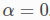

Writing documentation
---------------------

Marian’s documentation is generated using `Sphinx`_ + `Breathe`_ + `Doxygen`_ + `Exhale`_.
`Doxygen`_ is used for documenting the source code and `Sphinx`_ (together with the extensions of
`Breathe`_ and `Exhale`_) for managing handwritten documentation and generating library API
reference.

Whenever you add new code or propose changes to Marian, we would highly appreciate if you also add
new Doxygen comments or update existing ones as needed along with your changes (see the `Doxygen
guidelines`_ below). Your Doxygen comments will be integrated in the Marian’s documentation
automatically.

There is an ongoing and incremental effort with the goal of documenting essential Marian API in a
consistent way. The existing code might not follow these guidelines, but new code should.


Code documentation with Doxygen
```````````````````````````````

`Doxygen`_ is a powerful documentation system for C++ and many other languages that parses and
extracts documentation comments included in the source code to generate a comprehensive
documentation, for example, in HTML or LaTeX format.

Doxygen basics
**************

Doxygen recognises several special comment blocks with some additional markings. In Marian, we
follow the **Javadoc style**, which consist of a C-style comment block starting with two ``*``'s,
like this:

.. code:: cpp

    /**
     * ... text ...
     */

A documentation comment for all main entities in the code (e.g. classes, functions, methods, etc.)
always includes two sections: a *brief* summary and *detailed* description.  In Marian, a Java-style
comment block automatically starts a brief description which ends at the first dot followed by a
space or new line (i.e. there is no need to add the `@brief` keyword). Here is an example:

.. code:: cpp

    /**
     *  Brief description which ends at this dot. Details follow
     *  here.
     */

If you want to put documentation after members (e.g., a variable and enum), you have to put an
additional ``<`` marker in the comment block.

.. code:: cpp

    int var; ///< Brief description after the member

Doxygen commands
****************

More details in the documentation can be provided using special Doxygen's special commands
(keywords) which start with an at-sign (@).  See `Doxygen special commands`_ for the complete list
of available commands. Here, we list the most common Doxygen commands, which we use to document
Marian:

+-----------------------+-----------------------+-----------------------+
| Doxygen Command       | Detailed Description  | Example               |
+=======================+=======================+=======================+
| @param                | Add a parameter       | ``@param device a     |
|                       | description for a     | pointer to the        |
|                       | function parameter    | device``              |
+-----------------------+-----------------------+-----------------------+
| @return               | Add a return value    | ``@return a pointer   |
|                       | description for a     | to the constant       |
|                       | function              | node``                |
+-----------------------+-----------------------+-----------------------+
| @see                  | Add a cross-reference | ``@see reshape()``    |
|                       | to classes,           |                       |
|                       | functions, methods,   |                       |
|                       | variables, files or   |                       |
|                       | URL                   |                       |
+-----------------------+-----------------------+-----------------------+
| @ref                  | Create a reference to | ``@ref IndexType``    |
|                       | another item being    |                       |
|                       | documented.           |                       |
+-----------------------+-----------------------+-----------------------+
| @copybrief            | Copy the brief        | ``@copybrief slice``  |
|                       | description from the  |                       |
|                       | object specified      |                       |
+-----------------------+-----------------------+-----------------------+
| @copydetails          | Copy the detailed     | ``@copydetails dot``  |
|                       | documentation from    |                       |
|                       | the object specified  |                       |
+-----------------------+-----------------------+-----------------------+
| @note                 | Add a note message    | ``@note this is named |
|                       | where the text will   | after an equivalent   |
|                       | be highlighted        | function in PyTorch`` |
+-----------------------+-----------------------+-----------------------+
| @warning              | Add a warning message | ``@warning            |
|                       | where the text will   | not implemented``     |
|                       | be highlighted        |                       |
+-----------------------+-----------------------+-----------------------+
| @b                    | Display a single word | ``@b bold``           |
|                       | using a bold font     |                       |
+-----------------------+-----------------------+-----------------------+
| @c                    | Display a single word | ``@c void``           |
|                       | using a typewriter    |                       |
|                       | font                  |                       |
+-----------------------+-----------------------+-----------------------+
| @p                    | Display a single word | ``@p transA``         |
|                       | using a typewriter    |                       |
|                       | font. Equivalent to   |                       |
|                       | ``@c``                |                       |
+-----------------------+-----------------------+-----------------------+
| @em                   | Display a single word | ``@em x``             |
|                       | in italics.           |                       |
+-----------------------+-----------------------+-----------------------+

.. warning::

    Not all Doxygen special commands are supported in Exhale, e.g., `grouping`_
    [`1 <https://exhale.readthedocs.io/en/latest/faq.html#my-documentation-is-setup-using-groups-how-can-i-use-exhale>`_].
    Some commands like `@name`_ could lead to errors when parsing overloaded functions.
    To free yourself from debugging the Doxygen comments for hours, we recommend you only using the
    above commands.

Math formulas in Doxygen
************************

Doxygen supports LaTeX math formulas in the documentation. To include an inline formula that appears
in the running text, we need wrap it by a pair of ``@f$`` commands, for example:

.. code:: none

    Default is no smoothing, @f$\alpha = 0 @f$.

This will result in: Default is no smoothing, |formula1|



For the longer formulas which are in separate lines, we can put ``\f[`` and ``\f]`` commands between
the formulas, for instance:

.. code:: none

    @f[
       \operatorname{gelu}(x) = x \cdot \Phi(x)
         = x \cdot \frac{1}{2}\left[
            1 + \operatorname{erf}\left(\frac{x}{\sqrt{2}}\right)
         \right]
         \sim \operatorname{swish}(x, 1.702)
    @f]

This will result in:


   Example of formula 2

.. note::

    Make sure the formula contains *valid* commands in `LaTeX’s math-mode`_.

Recommendations
***************

First of all, add Doxygen comments in the header files. You can find the examples of Doxygen
comments in `src/graph/expression_graph.h`_.  A good practice is to keep Doxygen comments as
intuitive and short as possible. Try not to introduce unnecessary vertical space (e.g., an empty
line). A basic template of Doxygen comments is shown as follows:

.. code:: cpp

    /**
     * Brief summary.
     * Detailed description. More detail.
     * @see Some reference
     * @param <name> Parameter description.
     * @return Return value description.
     */


User documentation with Sphinx
``````````````````````````````

Sphinx supports `reStructuredText`_ and `Markdown`_ documents. Marian's user documentation files are
located in `doc`_.  The default format of Sphinx is `reStructuredText`_ and most of the framework's
power comes from the richness of its default `reStructuredText`_ markup format.


reStructuredText
****************

As Marian’s documentation is generated using `Sphinx`_ + `Breathe`_ + `Doxygen`_ + `Exhale`_,
reStructuredText is the best language to use if you need to utilise many ``directives`` generated by
Sphinx / Breathe / Exhale and are not satisfied with Markdown features as mentioned :ref:`below
<md-section>`.

There are many useful ``directives`` supported by Sphinx / Breathe / Exhale which you could use in
your user documentation. Here we highlight the most useful directives when documenting Marian.
For the complete reStructuredText syntax guide, please refer to the `mini guide`_ provided by
`Exhale`_. Sphinx docs also covers the most important aspects of reStructuredText. Read more in the
`reStructuredText tutorials provided Sphinx`_.

The first useful set of directives are `Breathe directives`_ which are used to include documentation
for different constructs. The available commands are listed below:

 .. code:: none

    .. doxygenindex::
    .. doxygenfunction::
    .. doxygenstruct::
    .. doxygenenum::
    .. doxygentypedef::
    .. doxygenclass::

The second one is `Exhale directives`_ which are used to link different constructs.  The available
commands are listed below:

 .. code:: none

    :class:`namespace::ClassName`
    :func:`namespace::ClassName::methodName`
    :member:`namespace::ClassName::mMemberName`
    :func:`namespace::funcName`

.. tip::
    1. reStructuredText is particularly sensitive to whitespace! If the rendered text does not turn
       out as what you expected, double check space(s) or newline(s).
    2. It takes several minutes to build Marian's documentation (mostly due to Exhale). If you work
       on a user documentation and need to check the rendered result frequently, you can comment out
       the exhale extension in ``conf.py`` file once :doc:`Marian code documentation
       <api/library_index>` is generated (i.e., building the whole documentation once). This will
       greatly speed up the documentation building.

.. _md-section:

Markdown
********

Although reStructuredText is more powerful than Markdown, it might feel less intuitive if you have
never used it before. Sphinx docs now use `MyST-Parser`_ as a default extension for handling
Markdown, which adds more Markdown-friendly syntax for the purpose of the documentation, in addition
to the `CommonMark`_ features. Read more in the `MyST-Parser documentation`_.

For instance, MyST-Parser supports `directives syntax`_, a generic block of explicit markup syntax
available in reStructuredText, such as ``note admonitions``:

 .. code:: none

    ```{note} Notes require **no** arguments, so content can start here.
    ```

The above markdown text will be rendered as below:

 .. note::

    Notes require **no** arguments, so content can start here.

Another useful feature is that you can include reStructuredText text/files into a Markdown file.
This means you can take advantage of ``directives`` generated by Sphinx / Breathe / Exhale with
ease, especially if you want to highlight/reference the functions or classes in :doc:`Marian code
documentation <api/library_index>`.
In general Sphinx docs only supports reStructuredText commands (such as `sphinx.ext.autodoc`_ and
`Breathe directives`_) to interact with the code documentation [`2 <https://myst-parser.readthedocs.io/en/latest/sphinx/use.html#>`_].

For example, let's assume that you want to include the function documentation of
``marian::inits::fromValue ( float )`` in the user documentation. You can use the following `Breathe
doxygenfunction directive`_ for this:

.. doxygenfunction:: marian::inits::fromValue(float)

To display the exactly same content as above, MyST-Parser offers the special `eval-rst directive`_
to wrap reStructuredText directives:

 .. code:: none

    ```{eval-rst}
    .. doxygenfunction:: marian::inits::fromValue(float)
    ```

Also, you can link functions or classes in :doc:`Marian code documentation <api/library_index>` with
`eval-rst directive`_. For example, to link ``marian::inits::fromValue(float)`` you can use the
following markdown syntax:

 .. code:: none

    ```{eval-rst}
     Link to :func:`marian::inits::fromValue`
    ```

Or you can directly link to the function in `markdown hyperlink syntax`_:

 .. code:: none

    Link to [`marian::inits::fromValue(float)`](api/function_namespacemarian_1_1inits_1a71bb6dee3704c85c5f63a97eead43a1e.html#_CPPv4N6marian5inits9fromValueEf)

Both outputs will be rendered with a clickable hyperlink to ``marian::inits::fromValue(float)`` in
the corresponding Library API page (as shown below):

   Link to :func:`marian::inits::fromValue`

.. note::

    The reference links for ``marian::inits::fromValue(float)`` is generated by `Exhale`_. For more
    information about how to cross-reference the code documentation, see `Exhale's linking
    strategy`_.


.. _Sphinx: https://www.sphinx-doc.org/en/master/usage/quickstart.html
.. _Breathe: https://breathe.readthedocs.io/en/latest/directives.html
.. _Doxygen: http://www.doxygen.nl/manual/docblocks.html
.. _Exhale: https://exhale.readthedocs.io/en/latest/usage.html
.. _Doxygen guidelines: #documentation-with-doxygen
.. _JAVADOC_AUTOBRIEF: https://www.doxygen.nl/manual/config.html#cfg_javadoc_autobrief
.. _Doxygen special commands: https://www.doxygen.nl/manual/commands.html
.. _grouping: https://www.doxygen.nl/manual/grouping.html
.. _@name: https://www.doxygen.nl/manual/commands.html#cmdname
.. _LaTeX’s math-mode: https://en.wikibooks.org/wiki/LaTeX/Mathematics
.. _src/graph/expression_graph.h: https://github.com/marian-nmt/marian-dev/blob/master/src/graph/expression_graph.h
.. _Markdown: https://www.sphinx-doc.org/en/master/usage/markdown.html
.. _reStructuredText: https://www.sphinx-doc.org/en/master/usage/restructuredtext/index.html
.. _doc: https://github.com/marian-nmt/marian-dev/tree/master/doc
.. _MyST-Parser: https://www.sphinx-doc.org/en/master/usage/markdown.html
.. _MyST-Parser documentation: https://myst-parser.readthedocs.io/en/latest/syntax/optional.html
.. _CommonMark: https://commonmark.org
.. _directives syntax: https://myst-parser.readthedocs.io/en/latest/syntax/syntax.html#directives-a-block-level-extension-point
.. _Breathe directives: https://breathe.readthedocs.io/en/latest/directives.html
.. _Breathe doxygenfunction directive: https://breathe.readthedocs.io/en/latest/directives.html#doxygenfunction
.. _sphinx.ext.autodoc: https://www.sphinx-doc.org/en/master/usage/extensions/autodoc.html#module-sphinx.ext.autodoc
.. _eval-rst directive: https://myst-parser.readthedocs.io/en/latest/syntax/syntax.html#syntax-directives-parsing
.. _Exhale's linking strategy: https://exhale.readthedocs.io/en/latest/usage.html#linking-to-a-generated-file
.. _mini guide: https://exhale.readthedocs.io/en/latest/mastering_doxygen.html#features-available-by-using-sphinx-breathe-exhale-by-way-of-restructuredtext
.. _reStructuredText tutorials provided Sphinx: https://www.sphinx-doc.org/en/master/usage/restructuredtext/index.html
.. _markdown hyperlink syntax: https://www.markdownguide.org/basic-syntax/#links
.. _Exhale directives: https://exhale.readthedocs.io/en/latest/usage.html#suggested-restructuredtext-linking-strategy
