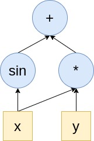
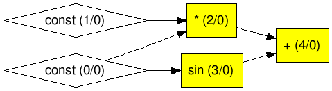
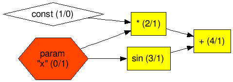
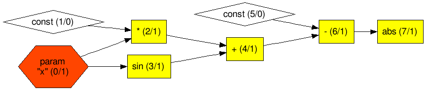

# Expression graphs

The design of the deep learning framework in Marian is based on reverse-mode [auto-differentiation](https://en.wikipedia.org/wiki/Automatic_differentiation) (also known as backpropagation) with dynamic computation graphs. 
Computation graphs allow a great deal of freedom in network architectures, and they can deal with complicated structures like conditions and loops.
The dynamic declaration, which means a new graph is created for each training instance (for a training example or a batch), is also advantageous.
It allows handling of variably sized inputs, as well as the cases where the graph may change depending on the results of previous steps.
Compared to static declaration, a dynamic computation graph could be expensive in terms of creating and optimising computation graphs.
Marian uses careful memory management to remove overhead in computation graph construction, and supports efficient execution on both CPU and GPU.
The main implementation of computation graph is in under [src/graph](dir_src_graph) directory.  

Building blocks for graphs:

- [graph construction](#graph-construction)
- [node types](#node-types)
- [graph execution](#graph-execution)

## Graph construction

What is a computation graph? 
All the numerical computations are expressed as a computation graph. 
A computation graph (or graph in short) is a series of operations arranged into a graph of nodes. 
To put it simply, a graph is just an arrangement of nodes that represent what you want to do with the data. 

**Example 1**

Suppose you want to calculate the expression: `z=x*y+sin(x)`. 

The computation graph of this expression is something like Figure 1.



*Figure 1 An example of computation graph*

In Marian, the `ExpressionGraph` class is the main implementation of a computation graph.
An `ExpressionGraph` object keeps a record of data (tensors) and all operations in a directed graph consisting of `Node` objects. 
A `Node` is the basic unit of a graph. It can be an operation (e.g., dot()), or a tensor. 
Each operation in a graph is a `NaryNodeOp` (a child of `Node` class). 
Each operation defines its forward and backward steps. 
Except for operations, a Node can also be a constant tensor (`ConstantNode`) or a parameter tensor (`ParamNode`). 

To create a graph, we use `New<>` shortcut in place of regular constructors:

```cpp
// create a graph
auto graph = New<ExpressionGraph>();
```

After creating a graph, we also need to initialise the graph object with device options by `setDevice()` and workspace memory by `reserveWorkspaceMB()`, otherwise the program will result in a crash.

```cpp
// initialise graph with device options
// here we specify device no. is 0
// device type can be DeviceType::cpu or DeviceType::gpu
graph->setDevice({0, DeviceType::cpu}); 
// preallocate workspace memory (MB) for the graph
graph->reserveWorkspaceMB(128); 
```
The _workspace memory_ means the size of the memory available for the forward and backward step of the training procedure. 
This does not include model size and optimizer parameters that are allocated outsize workspace. 
Hence you cannot allocate all device memory to the workspace.

To create a graph, Marian offers a set of shortcut functions that implements the common expression operators for a neural network (see [src/graph/expression_operators.h](file_src_graph_expression_operators.h), such as `affine()`. 
These functions actually construct the corresponding operation nodes in the graph, make links with other nodes. 
E.g., `affine()` construct a `AffineNodeOp` node in the graph. 
Thus, building a graph turns into a simple task of defining expressions by using those functions. 

**Building graph of Example 1 using Marian**

The following code is used to build the graph in Example 1 with inputs `x=2` and `y=3`.

```cpp
// create and initialise a graph object
auto graph = New<ExpressionGraph>();
graph->setDevice({0, DeviceType::cpu});
graph->reserveWorkspaceMB(8);
// add input node x
auto x = graph->constant({1,1}, inits::fromValue(2));
// add input node y
auto y = graph->constant({1,1}, inits::fromValue(3));
// define expression
auto mulOp = x*y;
auto sinOp = sin(x);
auto z = mulOp + sinOp;
// You can also define this expression: auto z = x*y + sin(x);
```

For the above example, `constant()` is used to construct a constant node (a tensor) in the graph as the input. 
We will give more details about this function in the next section [**Node types**](#node-types). 
The operators `*`, `+` and function `sin()` add corresponding operation nodes (i.e., `MultNodeOp` and `SinNodeOp`) in the graph.

To check the graph, Marian offers `graphviz()` function to generate graph layout in Graphviz format for visualisation. 
This visualisation might not be practical for real-size graphs due to an enormous number of nodes and layers. 
You can print the graph layout on console by running the following code:

```cpp
// print the graph layout on console
std::cout<<graph->graphviz()<<std::endl;
```

**Graph visualisation of Example 1**

The resulting graph is shown in Figure 2. Here we use an online Graphviz editor [edotor](https://edotor.net/) to generate the graph (by pasting the output of `graphviz()`).



*Figure 2 Graph layout of Example 1*

In Figure 2, there are two numbers (between the pair of parentheses) in each node. 
The first number indicates the node ID, and the second number specifies whether the node is trainable (0 means no; 1 means yes). 
We will cover the concept of *trainable* in [**ParamNode section**](#paramnode).

One thing to notice here is that Marian adopts dynamic computation graphs; 
this means that the nodes will be consumed once performing forward or backwards pass. 
Thus, we need to call `graphviz()` function before performing the computation.

## Node types

As mentioned earlier, `Node` is the basic unit of a graph. 
Each `Node` defines its forward steps in `Node::forward()` and backward steps in `Node::backward()`. 
To access the resulting new tensor in the forward pass, we can call `Node::val()`. 
While `Node::grad()` returns the accumulated gradients (a tensor) in the backward pass.
There are three main classes of Node in Marian: `ConstantNode`, `ParamNode` and `NaryNodeOp`.

### ConstantNode

The `ConstantNode` class is used to construct a constant node in the graph. 
A constant node is actually a constant tensor whose value is immutable during the training. 
A `ConstantNode` instance is usually used to construct the input layer.
To construct a constant node in the graph, we can use `constant()` function in the `ExpressionGraph` class. 
We need to specify the shape and element type for the constant node. 
For the shape, we can initialise a `Shape` instance in the way of vector initialisation. 
E.g., `Shape shape={2,3};` this means 2D matrix with `dim[0]`=2 and `dim[1]`=3.
The element type must be one of the values stored in `Type` enumeration. 
`Type` stores all supported data type in Marian, e.g., `Type::float16`.
If the type is not specified, the default type of graph will be used. 
The default type of the graph is usually `Type::float32` unless you change it by `setDefaultElementType()`. 

```cpp
// construct a constant node in the graph with default type
auto x = graph->constant({N, NUM_FEATURES}, inits::fromVector(inputData));
```

For the above example, the shape of the constant node is `{N, NUM_FEATURES}`, and the value of the constant node is initialised from a vector `inputData`.
`inits::fromVector()` returns a `NodeInitializer` which is a functor used to initialise a tensor by copying from the given vector. 
More functions used to initialise a node can be found in [src/graph/node_initializers.h](namespace_marian__inits) file. 
Marian also provides some shortcut functions to construct special constant nodes, such as `ones()` and `zeros()`:

```cpp
// construct a constant node with 1
auto ones = graph()->ones({10,10});
// construct a constant node with 0
auto zeros = graph()->zeros({10,10});
```

### ParamNode

`ParamNode` is used to store model parameters whose value can be changed during the training, such as weights and biases. 
In addition to the shape and the element type, we need to specify whether a `ParamNode` object is _trainable_ or not. 
If a parameter node is _trainable_, then its value will be tracked and updated during the training procedure.
For a `ParamNode`, the default value of `trainable_` is `true`. 
We can define whether this parameter node is trainable by `Node::setTrainable()` function.
To construct a parameter node in the graph, we use the `param()` function in the `ExpressionGraph` class. 
For a parameter node, we need to specify its name.

```cpp
// construct a parameter node called W1 in the graph
auto W1 = graph->param("W1", {NUM_FEATURES, 5}, inits::uniform(-0.1f, 0.1f));
```

The parameter node `W1` has a shape of `{NUM_FEATURES, 5}`, and is initialised with random numbers from the uniform distribution `Uniform(-0.1, 0.1)`. 

### NaryNodeOp

`NaryNodeOp` is the base class that defines the operations in a graph. 
It mainly contains unary and binary operators. 
Each `NaryNodeOp` defines its forward operations in `Node::forwardOps()` and backward operations in `Node::backwardOps()`. 
In the current version of Marian, we provide a set of common operations (inherited from `NaryNodeOp`) used to build a neural network, 
such as `AffineNodeOp` (affine transformation), `CrossEntropyNodeOp` (cross-entropy loss function) and `TanhNodeOp` (tanh activation function). 
As mentioned earlier, Marian implements a set of APIs that can easily add operations to the graph. 
E.g., we can use `affine()` to perform affine transformation and then `tanh()` to perform tanh activation function on the results:

```cpp
// perform affine transformation: x*W1+b
// and then perform tanh activation function
auto h = tanh(affine(x, W1, b1));
```

In the above example, `affine()` and `tanh()` actually add `AffineNodeOp` and `TanhNodeOp` nodes to the graph. 
For more shortcut functions used to add operations in the graph, you can find in [src/graph/expression_operators.h](file_src_graph_expression_operators.h) file.

## Graph execution

Once you finish building a graph by adding all the nodes, now you can perform the real computation.

### Forward pass

The forward pass refers to the calculation process. 
It traverses through all nodes from the input layer (leaves) to the output layer (root). 
To perform the forward pass, you can call the function `forward()`. The `forward()` function mainly does two things:

- allocates memory for each node (`Node::allocate()`)
- computing the new tensor for each node by performing required operations (`Node::forward()`), and the resulting new tensor is stored in `val_` attribute in each Node.

**Forward pass of Example 1**

To run the forward pass of Example 1, you can run the following code:

```cpp
// Perform the forward pass on the nodes of the graph
graph->forward();
// get the computation result of z
std::vector<float> w;
z->val()->get(w);
std::cout<<"z="<<w[0]<<std::endl;
// The output is: z=6.9093
```

### **Backward pass**

The backward pass refers to the process of computing the output error. 
It traverses through all *trainable* nodes from the output layer to the input layer. 
You can call `backward()` to perform the backward pass. 
The `backward()` function mainly computes the gradients using the chain rule:

- allocates memory and initialise gradients for each *trainable* Node
- computes the gradients based on backward steps (`Node::backwardOps()`) from each Node, and stores them in `adj_` attribute in each Node
- using the chain rule, propagates all the way to the input layer

We also provide a shortcut function `backprop()` which performs first the forward pass and then the backward pass on the nodes of the graph:

```cpp
// Perform backpropagation on the graph
graph->backprop();
// This function is equal to the following code:
/* 
   graph->forward();
   graph->backward();
*/
```

**Backward pass of modified Example 1**

As shown in Figure 2, there is no trainable node in the graph of Example 1; 
this means we cannot perform backwards pass on this graph. 
To demonstrate the backward pass, we modify Example 1 by changing the constant node `x` to a parameter node (change `constant()` to `param()`). 
Here is the modification:

```cpp
// add parameter node x
auto x = graph->param("x", {1,1}, inits::fromValue(2));
```

The resulting graph is also different as displayed in Figure 3.




*Figure 3 Graph layout of modified Example 1*

To perform the backward pass of modified Example 1, you can run the following code:

```cpp
// Perform the backward pass on the trainable nodes of the graph
graph->backward();
// get the gradient of x node
std::vector<float> b;
x->grad()->get(b);
std::cout<<"dz/dx="<<b[0]<<std::endl;
// The output is: dz/dx=2.58385
```

### Optimiser

After the backward pass, we obtain the gradients of the leaves. 
However, the job is not done yet. 
To train a model, we need to update the model parameters according to the gradients.
This comes to how we define the loss function and optimiser for the graph. 

A loss function is used to calculate the model error between the predicted value and the actual value. 
The goal is to minimise this error during training. 
In a graph, the loss function is also represented as a group of node(s). 
You can also use the operators provided in [src/graph/expression_operators.h](file_src_graph_expression_operators.h) file to define the loss function. 
E.g., Marian offers `cross_entropy()` function to compute the cross-entropy loss between true labels and predicted labels.

**Define a loss function for modified Example 1**

Suppose we know the actual value of `z` is 6 with `y = 3`, and `x` is the parameter we would like to learn from the model. 
The loss function we choose here is the absolute error:

```cpp
// pass the actual value to the model
auto actual = graph->constant({1,1}, inits::fromValue(6));
// define loss function
auto loss = abs(actual-z);
```

The graph is changed to Figure 4. 



*Figure 4 Graph layout of modified Example 1 with loss function*

The purpose of the optimiser is to adjust the variables to fit the data. 
In Marian, there are three built-in optimiser classes: `Sgd`, `Adagrad` and `Adam`.
`Sgd` is an optimiser based on [stochastic gradient descent](https://en.wikipedia.org/wiki/Stochastic_gradient_descent). 
For each iteration, it updates the parameter `w` according to the rule of `w = w - learning_rate * gradient`. 
`Adagrad` implements [Adagrad algorithm](https://www.jmlr.org/papers/volume12/duchi11a/duchi11a.pdf), 
an optimiser with parameter-specific learning rates, which are adapted relative to how frequently a parameter gets updated during training.
`Adam` is an implementation of the [Adam algorithm](https://arxiv.org/abs/1412.6980),
 a stochastic gradient descent method that is based on an adaptive estimation of first-order and second-order moments. . 
We use `Optimizer<>` to set up an optimiser with the learning rate:

```cpp
// Choose optimizer (Sgd, Adagrad, Adam) and initial learning rate
auto opt = Optimizer<Adam>(0.01);
```

After an iteration of backpropagation, we can call `update()` function to update the parameters:

```cpp
// update parameters in the graph
opt->update(graph);
```

**Set up an optimiser for modified Example 1**

Continue with Example 1, we choose `Sgd` as the optimiser and update the parameter `x`:

```cpp
// set up Sgd optimiser with 0.005 learning rate
auto opt = Optimizer<Sgd>(0.005);
// update parameters
opt->update(graph);
// get the new value of x
std::vector<float> v;
x->val()->get(v);
std::cout<<"x="<<v[0]<<std::endl;
// The output is: x=1.98708
```
### Debugging
For debugging, we can call `debug()` to print node parameters. The `debug()` function has to be called prior to graph execution. 
Once a node is marked for debugging, its value (resulting tensor) and the gradient will be printed out during the forward and backward pass. 
It is also recommended to turn on Marian logger by calling `createLoggers()` for more information.

**Debugging for modified Example 1**

Suppose we want to check the results of node `x` during the computation. We can call `debug()` to mark node `x` for debugging. 
```cpp
// mark node x for debugging with logging message "Parameter x"
debug(x, "Parameter x");
```
The output is shown as follows with `createLoggers()`:
```cpp
[2021-02-16 15:10:51] [memory] Reserving 256 B, device gpu0
[2021-02-16 15:10:51] Debug: Parameter x op=param
[2021-02-16 15:10:51] shape=1x1 size=1 type=float32 device=gpu0 ptr=140505547538432 bytes=256
min: 2.00000000 max: 2.00000000 l2-norm: 2.00000000
[[   2.00000000 ]]

[2021-02-16 15:10:51] [memory] Reserving 256 B, device gpu0
[2021-02-16 15:10:51] Debug Grad: Parameter x op=param
[2021-02-16 15:10:51] shape=1x1 size=1 type=float32 device=gpu0 ptr=140505547538944 bytes=256
min: 2.58385324 max: 2.58385324 l2-norm: 2.58385324
[[   2.58385324 ]]
```

### More advanced

For more details about graph execution, a graph keeps track of all the `Node` objects in its `nodesForward_` and `nodesBackward_` lists. 
`nodesForward_` contains all nodes used for the forward pass and `nodesBackward_` contains all trainable nodes used for the backward pass. 
All the tensor objects for a graph are stored in its `tensors_` attribute. 
`tensors_` is a shared pointer holding memory and nodes for a graph. 
Since each `Node` can result in new tensors, this attribute is used to allocate memory for new tensors during the forward and backward pass.
This `tensors_` attribute gets cleared before a new graph is built. 
Another important attribute in `ExpressionGraph` is `paramsByElementType_`. 
This attribute holds memory and nodes that correspond to graph parameters.
You can call `params()` function in a graph to get all the parameter objects:

```cpp
// return the Parameters object related to the graph
// The Parameters object holds the whole set of the parameter nodes.
graph->params();
```

Besides, we provide APIs to support the mechanism of Gradient Checkpointing. 
This method works by trading compute for memory, which reruns a forward-pass segment for each checkpoint segment during the backward pass. 
Currently, Marian only supports setting checkpoint nodes manually by calling `Node::markCheckpoint()` or `checkpoint()`. 
To enable the gradient-checkpointing mode for a graph, we use `setCheckpointing()`:

```cpp
// enable gradient-checkpointing for a graph
graph->setCheckpointing(true);
```

We can also save and load the parameters of a graph in Marian. 
We can call `save()` to save all parameters in the graph into a file (`.npz` or `.bin` format). 
The function `load()` can load all model parameters to the graph (either from an array of `io::Items`, a file or a buffer).

```cpp
// specify the filename
std::string filename = "my_model.npz";
// save all the parameters into a file
graph->save(filename);
// load model from a file
graph->load(filename);
```